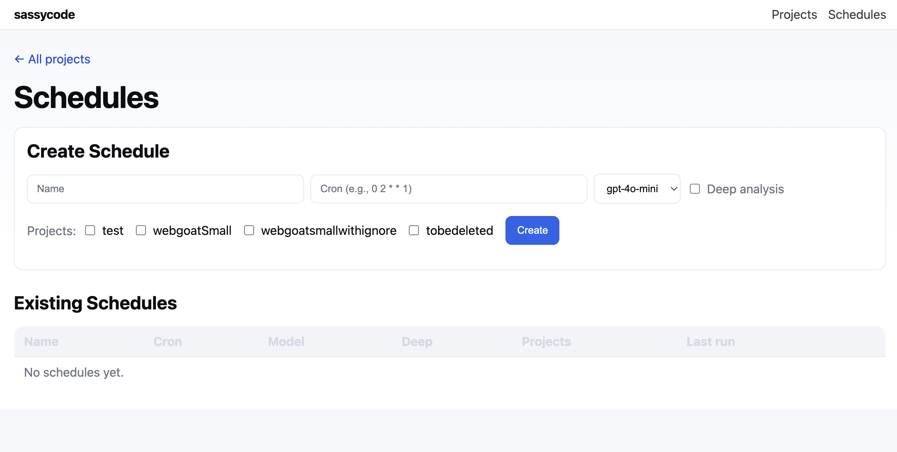

# sassycode

<div align="center">
  
  
  <br/>
  
  
  <br/>
  <em>Overview, scan triggering, findings, and details</em>
  <br/>
  <br/>
  <hr/>
  <br/>
  
</div>

Two-part Python project:

- Scanner CLI: runs standalone SAST scans on a folder and prints JSON findings
- Management server: launches scans, ingests results into SQLite, and provides a minimal web UI

## Quickstart

1. Create venv and install

```bash
python3 -m venv .venv && source .venv/bin/activate
pip install -e .
```

2. Configure environment

```bash
cp env.example .env
export $(grep -v '^#' .env | xargs)  # or use a shell that auto-loads .env
```

3. Run scanner (standalone)

```bash
sassycode-scanner scan --path /path/to/repo --model gpt-4o-mini
```

### CI/CD ingestion to management console

Post scan results to the running console (auto-creates/updates the Project):

```bash
# The CLI still prints JSON to stdout; posting is optional.
sassycode-scanner scan \
  --path /path/to/repo \
  --model gpt-4o-mini \
  --concurrency 8 \
  --include-related \
  --post-to http://localhost:3000 \
  --project-name my-repo
```

### Branch / PR-only scans

Scan only the files changed on a branch (diff vs merge-base with HEAD):

```bash
sassycode-scanner scan \
  --path /path/to/repo \
  --model gpt-4o-mini \
  --branch Feature7 \
  --concurrency 8 \
  --post-to http://localhost:3000 \
  --project-name my-repo
```

Scan only the files changed between two refs (explicit base/head):

```bash
sassycode-scanner scan \
  --path /path/to/repo \
  --model gpt-4o-mini \
  --git-base origin/main --git-head Feature7 \
  --post-to http://localhost:3000 \
  --project-name my-repo
```

Scan only the files in a GitHub PR (uses GitHub API; set GITHUB_TOKEN or GH_TOKEN if needed):

```bash
sassycode-scanner scan \
  --path /path/to/repo \
  --model gpt-4o-mini \
  --github-pr juice-shop/juice-shop#2783 \
  --post-to http://localhost:3000 \
  --project-name juice-shop
```

Scan only your working tree changes vs HEAD:

```bash
sassycode-scanner scan --path /path/to/repo --model gpt-4o-mini --only-changed
```

### Run the CLI without activating the venv

You can invoke the CLI directly using the venv binaries or by adjusting PATH:

```bash
# 1) Direct console script
~/sassycode/.venv/bin/sassycode-scanner scan --path /path --model gpt-4o-mini

# 2) Module invocation with the venv's Python
~/sassycode/.venv/bin/python -m scanner.cli scan --path /path --model gpt-4o-mini

# 3) Temporary PATH prepend
PATH=~/sassycode/.venv/bin:$PATH \
sassycode-scanner scan --path /path --model gpt-4o-mini

# 4) Inline env vars (e.g., OpenAI key) with direct binary
OPENAI_API_KEY=YOUR_KEY \
~/sassycode/.venv/bin/sassycode-scanner scan --path /path --model gpt-4o-mini
```

Alternate ways to run the scanner (equivalent):

```bash
# 1) Console script (shown above)
sassycode-scanner scan --path "~/WebGoat" --model gpt-4o-mini --verbose

# 2) Module invocation (no entrypoint needed)
python -m scanner.cli scan --path "~/WebGoat" --model gpt-4o-mini --verbose

# 3) Direct file execution (ensure PYTHONPATH points to repo root)
PYTHONPATH=~sassycode \
python ~/sassycode/scanner/cli.py scan --path "~/WebGoat" --model gpt-4o-mini --verbose
```

4. Run management server

```bash
sassycode-manager --reload
```

Open http://localhost:3000 to use the UI (default port can be overridden with `--port` or `PORT`).

## Notes

- Requires Python 3.11+
- Uses SQLite by default; see `DATABASE_URL` in `.env`
- OpenAI key required: set `OPENAI_API_KEY`
 - Some models (e.g., `gpt-5`) enforce a fixed temperature. The scanner automatically omits the `temperature` param for these to avoid errors.
